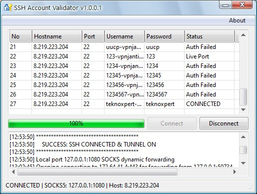

# SSH Account Validator & Checker

**Free SSH Account Validator & Checker** adalah aplikasi desktop berbasis Windows yang digunakan untuk memverifikasi akun SSH secara cepat dan akurat melalui file konfigurasi akun. Tool ini membantu pengguna memastikan apakah akun SSH masih aktif, gagal autentikasi, atau siap digunakan untuk membangun **SSH Tunnel (SOCKS Proxy)**.

Aplikasi ini dirancang untuk kebutuhan edukasi, testing koneksi SSH, dan pembelajaran dasar jaringan komputer.

---

## ✨ Fitur Utama

* Validasi akun SSH secara otomatis dari file
* Deteksi status koneksi (Connected / Authentication Failed)
* Dukungan **Dynamic Port Forwarding (SOCKS Proxy)**
* Log koneksi real-time
* Antarmuka sederhana dan ringan
* Mendukung Windows 32-bit & 64-bit

---

## 🖥️ Sistem Operasi yang Didukung

> ✅ **Windows 32-bit**
> ✅ **Windows 64-bit**
> ❌ Linux (tidak didukung)
> ❌ macOS (tidak didukung)

---

## 🖼️ Tampilan Aplikasi

Berikut adalah tampilan antarmuka **SSH Account Validator**:

```markdown

```

---

## 📂 Format File Akun (`account.txt`)

Semua data akun SSH disimpan dan dibaca dari file berikut:

```
account.txt
```

### Format Penulisan Akun

Setiap akun ditulis dalam **satu baris** dengan format:

```
hostname|port|username|password
```

### Contoh:

```
example.com|22|user123|password123
192.168.1.10|2222|admin|adminpass
```

> Pastikan tidak ada spasi tambahan dan format tetap konsisten agar aplikasi dapat membaca data dengan benar.

---

## 🚀 Cara Menggunakan

1. **Ekstrak aplikasi** ke satu folder (disarankan satu direktori)
2. Buka file **`account.txt`** menggunakan text editor (Notepad, VS Code, dll)
3. Masukkan data akun SSH dengan format:

   ```
   hostname|port|username|password
   ```
4. Simpan file `account.txt`
5. Jalankan aplikasi **SSH Account Validator**
6. Aplikasi akan otomatis membaca file `account.txt`
7. Tekan tombol **Check / Validate**
8. Periksa status akun:

   * **Connected** → Akun SSH aktif
   * **Auth Failed** → Username atau password salah
   * **Connection Error** → Host atau port bermasalah

Jika akun berhasil terhubung, aplikasi akan otomatis mengaktifkan **SSH Tunnel (SOCKS Proxy)**.

---

## ⚙️ Cara Kerja Singkat

1. Aplikasi membaca daftar akun dari `account.txt`
2. Melakukan autentikasi SSH ke setiap server
3. Menampilkan status koneksi pada tabel
4. Mengaktifkan **Dynamic Port Forwarding** saat koneksi berhasil
5. Menyediakan SOCKS Proxy untuk aplikasi lain yang mendukung proxy

---

## 📌 Kegunaan

* Validasi akun SSH sebelum digunakan
* Pembelajaran SSH dan networking
* Testing koneksi server SSH
* Simulasi SSH Tunnel & SOCKS Proxy
* Edukasi jaringan komputer

---

## 🔐 Keamanan & Etika

> Proyek ini dibuat **hanya untuk tujuan edukasi dan pengujian**.
> Gunakan **akun SSH yang Anda miliki izin aksesnya**.
> Segala bentuk penyalahgunaan menjadi tanggung jawab pengguna.

---

## 📄 Lisensi

Proyek ini menggunakan **MIT License**.
Bebas digunakan, dimodifikasi, dan didistribusikan sesuai ketentuan lisensi.

---

## ⭐ Dukungan

Jika proyek ini bermanfaat:

* Beri ⭐ pada repository
* Bagikan ke rekan belajar
* Gunakan secara bijak dan bertanggung jawab

---
